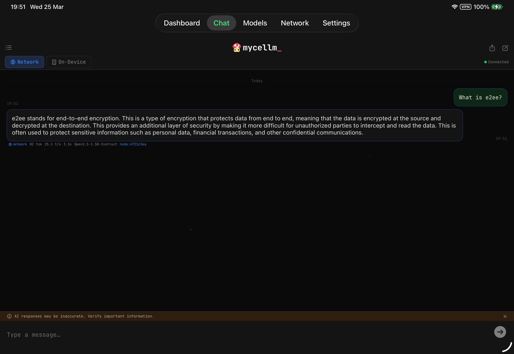
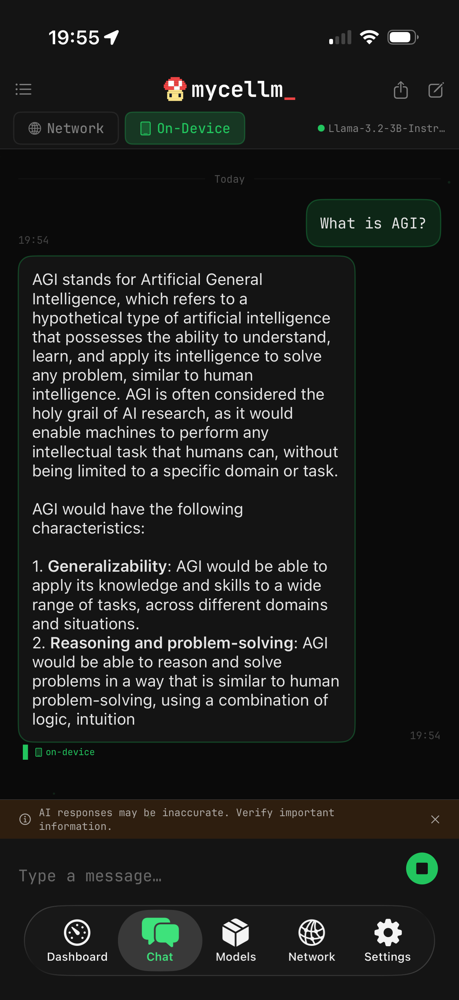
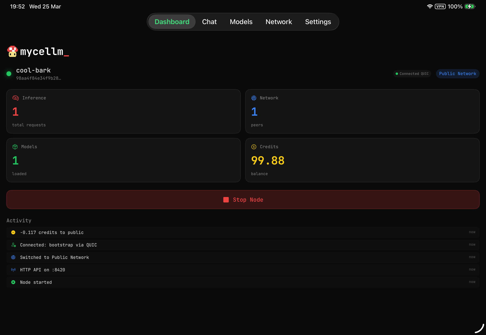
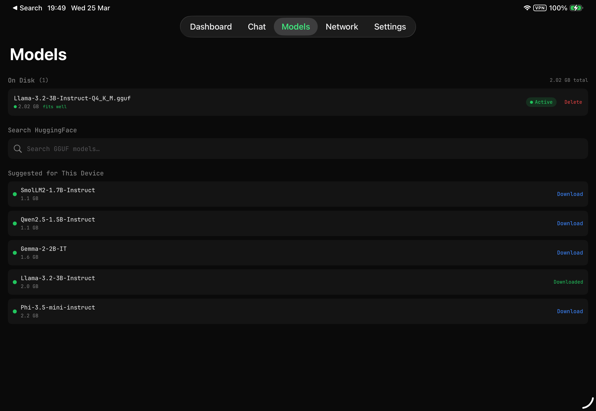

<p align="center">
  
</p>

<h1 align="center">mycellm_ iOS</h1>

<p align="center">
  <strong>The only distributed inference app for iOS.</strong><br>
  <em>Your iPad is a peer, not just a client. Serve models. Earn credits. Chat privately.</em>
</p>

<p align="center">
  <a href="LICENSE"></a>
  <a href="https://developer.apple.com/swift/"></a>
  <a href="https://developer.apple.com/ios/"></a>
  <a href="https://mycellm.ai"></a>
</p>

<p align="center">
  <a href="https://mycellm.ai">Website</a> ·
  <a href="https://docs.mycellm.dev">Docs</a> ·
  <a href="https://github.com/mycellm/mycellm">CLI / Server</a>
</p>

---

<p align="center">
  
</p>

## What is this?

The mycellm iOS app turns any iPhone or iPad into a full peer on the [mycellm](https://github.com/mycellm/mycellm) distributed inference network — not just a client, but a node that serves inference to others. An iPad Pro with an M-series chip runs 3B+ models at 30+ tokens/sec on Metal. No other distributed inference project has a native mobile app.

- **On-device inference** — llama.cpp on Metal, streaming tokens with thermal throttling
- **Network + local routing** — toggle per message, automatic fallback if network fails
- **Sensitive Data Guard** — auto-scans prompts for PII and redirects to local model before sensitive data leaves your device
- **Chat persistence** — threaded conversations with metadata (model, node, tokens/sec, route). Export, share, and private ephemeral sessions.
- **Credit economy** — earn credits by seeding, spend them consuming. Signed receipts, no blockchain.
- **OpenAI-compatible API** — your device serves `/v1/chat/completions` on your LAN for other tools

<p align="center">
  
</p>

## Requirements

- iOS 17.0+
- Xcode 16.0+
- Swift 6.0
- [XcodeGen](https://github.com/yonaskolb/XcodeGen) (for project generation)

## Building

```bash
# Generate Xcode project from project.yml
xcodegen generate

# Open in Xcode
open Mycellm.xcodeproj
```

Select your device or simulator and build (⌘B). SPM dependencies (SwiftCBOR, Hummingbird, llama.swift) resolve automatically.

### Configuration

The project uses XcodeGen (`project.yml`) for reproducible project generation. Key settings:

| Setting | Value |
|---------|-------|
| Bundle ID | `com.mycellm.app` |
| Deployment Target | iOS 17.0 |
| Swift Version | 6.0 (strict concurrency) |
| Device Families | iPhone + iPad |

> **Note:** Set your own `DEVELOPMENT_TEAM` in `project.yml` before building.

## Architecture

```
Mycellm/
├── Core/
│   ├── Identity/      Ed25519 keypairs, device certs, Keychain storage
│   ├── Transport/     QUIC via NWConnection, TLS, peer management
│   ├── Protocol/      CBOR message envelopes, 20 message types
│   ├── Network/       NodeService facade, bootstrap client, fleet handler
│   ├── API/           Hummingbird HTTP server, OpenAI-compatible routes
│   ├── Inference/     llama.swift engine, model lifecycle, thermal throttle
│   ├── Accounting/    Credit ledger, signed receipts
│   ├── NAT/           STUN discovery, UDP hole punching
│   ├── Privacy/       Sensitive data guard (PII/credential scanning)
│   └── Storage/       SwiftData models, UserDefaults preferences
├── Views/
│   ├── Dashboard/     Node KPIs, activity feed
│   ├── Chat/          Streaming chat with routing + node attribution
│   ├── Models/        Model browser, HuggingFace search, load/unload
│   ├── Peers/         Connected peers, network membership
│   ├── Settings/      Identity, privacy, remote endpoints, tip jar
│   └── Components/    Splash screen, screensaver
└── Utilities/         CBOR coding, compression, hardware info
```

<p align="center">
  
  
</p>

### Design Principles

- **Actor isolation** — `InferenceEngine`, `BootstrapClient`, `CreditLedger` are actors for thread safety
- **Observable state** — `NodeService` and `ModelManager` use `@Observable` for reactive UI
- **Service facade** — Views interact with `NodeService`, not internal subsystems
- **Dark mode only** — Void Black (#0A0A0A) background, JetBrains Mono typography
- **Protocol compatible** — CBOR message format matches the Python daemon exactly

### API Endpoints Served

| Method | Path | Description |
|--------|------|-------------|
| GET | `/health` | Health check |
| GET | `/v1/models` | List loaded models |
| POST | `/v1/chat/completions` | Chat (streaming + non-streaming) |
| GET | `/v1/node/status` | Node status |
| GET | `/v1/node/system` | Hardware info |

## Built with AI

This project was developed in collaboration with [Claude Code](https://claude.ai/code) by Anthropic. Claude served as a pair-programming partner throughout architecture design, implementation, and testing. All technical decisions, project direction, and code review are my own.

## Credits

Built by [Michael Gifford-Santos](https://github.com/mijkal).

- **AI pair programming**: [Claude Code](https://claude.ai/code) by Anthropic
- **Inference**: [llama.swift](https://github.com/mattt/llama.swift) by Mattt
- **HTTP server**: [Hummingbird](https://github.com/hummingbird-project/hummingbird)
- **Serialization**: [SwiftCBOR](https://github.com/valpackett/SwiftCBOR)
- **Typography**: [JetBrains Mono](https://github.com/JetBrains/JetBrainsMono)

## License

Apache 2.0 — see [LICENSE](LICENSE).

"mycellm" and the mycellm logo are trademarks of Michael Gifford-Santos.
See [TRADEMARK.md](TRADEMARK.md) for usage guidelines.

---

<p align="center">
  <sub>mycellm_ — /my·SELL·em/ — mycelium + LLM</sub>
</p>
